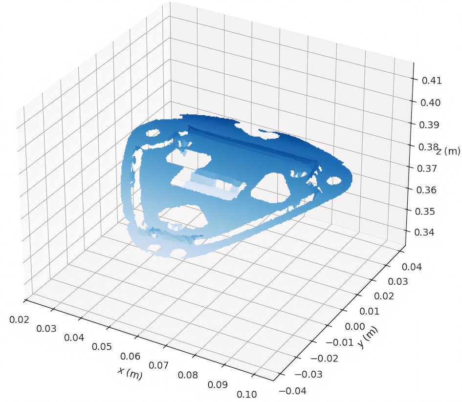
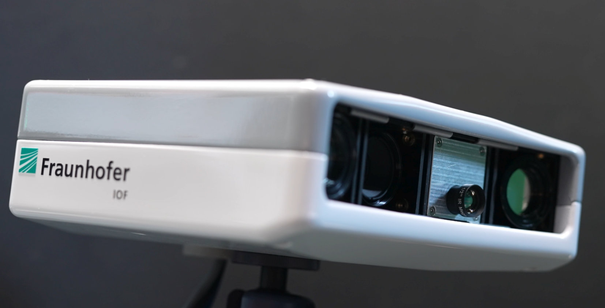
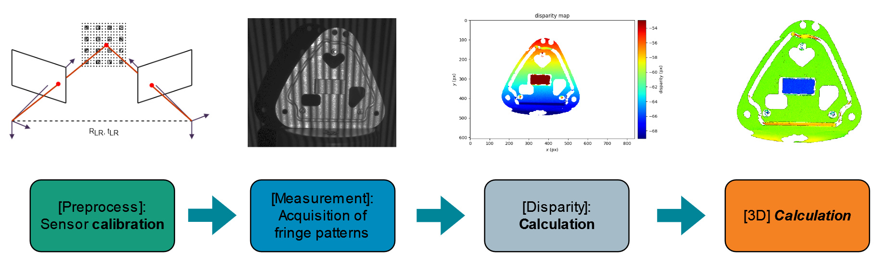
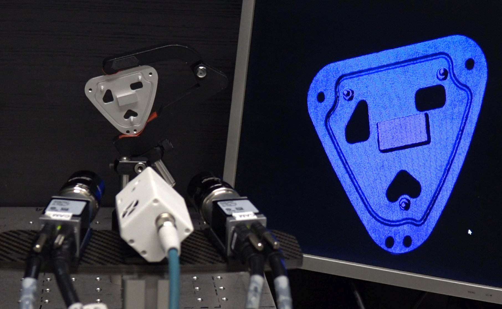
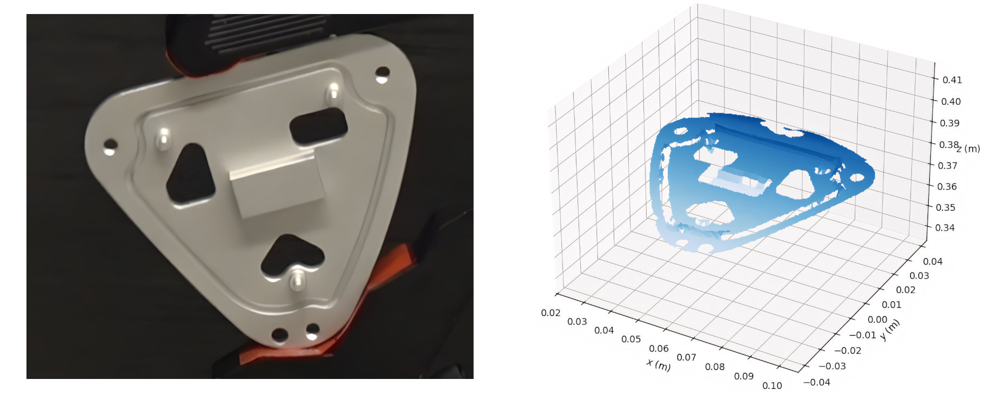

# Open Source sensor module "ApSi3D"

## SWAP-IT Use-Case "Components to Distributed Workstations"

1. [Overview](#overview)
2. [Architecture](#architecture)
3. [Getting started](#getting-started)
4. [Tutorial](#tutorial)
5. [How-To](#how-to)
6. [Contact](#contact)
7. [Related projects](#related-projects)
8. [Glossary](#glossary)

### Overview

The [SWAP-IT architecture](https://ieeexplore.ieee.org/document/9926665) was developed as part of the [Fraunhofer lighthouse project SWAP-IT](https://www.produktion.fraunhofer.de/en/research/research-cooperations/lighthouse-projects/swap.html). This new technological concept makes it possible to implement the production of tomorrow by transforming rigid production environments with individual processing stations into flexible and dynamic production environments. The core of this innovation is a modular cyber-physical production system (CPPS) that efficiently integrates centralized and decentralized elements as a network of software and mechanical components. The modules are specially designed to adapt seamlessly to different production environments and can be further developed with minimal effort. The benefits of this approach are demonstrated in the use-case [**"Components to Distributed Workstations"**](https://www.produktion.fraunhofer.de/en/research/research-cooperations/lighthouse-projects/swap/bauteile-zu-verteilten-arbeitsstationen.html).

As stated in the above use case description, in order to increase the technical flexibility and to map a variety of product, manufacturing resources are enabled to the "Automation of Automation".

The diversity of variants in the process is achieved by integrating the SWAP-IT architecture to increase organizational flexibility and optimize utilization. Flexible chaining of workstations via freely navigating driverless transport vehicles enables an order-specific material flow. AI-supported optimization algorithms can be used to optimally distribute the workload among the production resources in order to realize a low turnaround time. This makes it possible to implement highly flexible production systems that manufacture customized products of the highest quality in a cost-efficient and sustainable manner.

One such workstation in the process chain can be a quality / process control station. Parts in process can be checked here for compliance with their specification. Traditionally, each sensor manufacturer provided its sensors with its own control and data interface. To effectively integrate such sensors into flexible and dynamic production environments, not only the physical integration (like handling systems, power and data connections), but also the logical control and data interface had to be adapted. Within the SWAP-IT use-case "Component Swarms" Fraunhofer IOF has succeeded in developing a new 3D sensor, which realizes a compact, high-resolution 3D scanner (see [Fig. 1](#fraunhofer_IOF_3D_Scanner)), that offers its scanning services in a standardized format via network to a production system. The networking and communication of the measuring equipment is realized via the SWAP-IT architecture, specifically, service discovery, parameter control, and 3D scan service itself is handled via OPC UA.

*Fig. 1: 3D scanner developed by Fraunhofer IOF. It can be integrated in the SWAP-IT architecture. With the help of the SWAP-IT architecture, industrial manufacturing processes are to become more flexible, efficient and cost-saving in the future (see [press release](https://www.iof.fraunhofer.de/en/pressrelease/2023/production-architecture-swap-it-for-efficient-manufacturing-proc.html)).*

For more information about the 3D scanning technology and other High-Speed 3D Measurement Systems developed by Fraunhofer IOF, please visit the [Imaging and Sensing Website](https://www.iof.fraunhofer.de/en/competences/imaging-sensing/3d-sensing/high-speed-measurement-systems.html).

### Architecture

For this use case, and the Open Source sensor module "ApSi3D" in particular, we furthermore focus on the 3D calculation aspect of the Component Swarms. The generic 3D calculation pipeline used is shown in [Fig. 2](#3D_Pipeline).

*Fig. 2: Generic 3D calculation pipeline: with a previously performed calibration, from the acquired fringe patterns a map of the disparity is calculated. As a last step, this disparity is transformed into a 3D data set.*

It consists of the following steps:

1. [Preprocess] **Parametrization** of the scan process: Various 3D scanning parameters can be adjusted for the given scanning task (like scanner exposure time, 3D calculation parameters, post-processing filter settings)
2. [Preprocess] **Calibration**: The 3D scanner, using an stereo-based pattern-correlation approach, requires a calibration of the primary and secondary camera.
3. [Measurement] **Image data capture**: A series of aperiodic sinusoidal fringe patterns is projected onto the measurement object and synchronously captured by the two cameras.
4. [Disparity] **Disparity calculation**: Using correspondence search on the rectified images, for each pixel in the primary camera the corresponding pixel in the secondary camera is determined. The sub-pixel accurate horizontal displacement is called the disparity and stored for further processing.
5. [3D] **3D calculation**: Using the Q-matrix from the calibration and the disparity, the corresponding 3D data (as *xyz*-points) can be easily calculated, as shown in the section [Getting Started](#getting-started).
6. [Postprocess] **Data presentation**: As last step of the pipeline, the measured and calculated 3D data can be send to the recipient, e.g., via network, or can be displayed locally.

### Getting Started

For the sake of reducing complexity, we provide calibration and measurement data. Both are acquired with the 3D sensor (see Fig. 3) developed by Fraunhofer IOF in the context of the "*Component Swarms*" SWAP-IT project.

*Fig. 3: Laboratory setup with the sensors stereo camera setup and pattern projector in the front left, the aluminum casting in the background and the live 3D reconstruction on the display in the right.*

More information about the high-speed 3D scanning technology using GOBO projection, see: [S. Heist et al., "High-speed three-dimensional shape measurement using GOBO projection," Optics and Lasers in Engineering, Volume 87, 2016, Pages 90-96, ISSN 0143-8166, DOI 10.1016/j.optlaseng.2016.02.017](https://doi.org/10.1016/j.optlaseng.2016.02.017).

For the following tutorial, we focus on an aluminum casting (see Fig. 4). We demonstrate, how to process the bandwidth-optimized intermediate disparity data in order to obtain a full *xyz* point cloud at the receiving agent:

*Fig. 4: Left: Photo of an aluminum cast used for the tutorial. Right: Resulting 3D reconstruction as output of the tutorial.*

To begin with, create a *working directory* in your workspace and change to that directory, then clone the repository [ApSi3d](https://gitlab.cc-asp.fraunhofer.de/swap/entwicklungen/swap-os-components/swap-apsi3d). It contains this documentation, the sensor module's source code, and example data for the [Tutorial](#tutorial).

Along with the source and this documentation, we also provide sample data of the aforementioned test object, and sensor calibration, to get you started. These are the measurements disparity result as `Python NumPy` object "*disparity.npy*" (array of type double), and a textual representation of `Q-matrix` "*qmatrix.json*" (for an academic explanation, see, e.g. this Stack Overflow [discussion](https://stackoverflow.com/a/28317841). To access both, navigate to the "*Release*" section (or "*Deploy*" &rarr; "*Releases*") and download the sample data.

### Tutorial

We provide a beginners tutorial, showing how to process the provided disparity data, along with the associated calibration. At the end of the calculation, you will be displayed the disparity values of the test sample, as well as a interactive 3D rendering of the resulting 3D reconstruction. To use the provided source on your own measurements, refer to the [How-To](#how-to) section.

First, clone the repository using `git`:

~~~
git clone  https://github.com/IOF-SWAP/swap-apsi3d
~~~

Then open a python terminal and change into the source directory. For convinience you can create and activate a virtual environment in the source folder:

~~~
python -m venv env
env\Scripts\activate
~~~

Next, install the required packages (mainly numpy, PyQt6, matplotlib):

~~~
pip install -r requirements
~~~

Now the input data file (contents see section [Getting started](#getting-started)) must be provided in the same working directory. Finally you can start the data processing by:

~~~
python recon-workflow.py
~~~

As result, two figures are calculated and shown on the display: the input disparity, and the 3D data, as seen as in Fig. 4.

#### Contributing

Contributions are what make the open source community such an amazing place to learn, inspire, and create. Any contributions you make are **greatly appreciated**.

If you have a suggestion that would make this better, please fork the repo and create a pull request. You can also simply open an issue with the tag "enhancement".
Don't forget to give the project a star! Thanks again!

1. Fork the Project
2. Create your Feature Branch (`git checkout -b feature/AmazingFeature`)
3. Commit your Changes (`git commit -m 'Add some AmazingFeature'`)
4. Push to the Branch (`git push origin feature/AmazingFeature`)
5. Open a Pull Request

### How-To

So far we have shown how to process the provided sample data. To process your own data, you would calibrate your stereo camera setup, rectify the image pairs, detect corresponding pixels and write their displacement into a `Python NumPy` object "*disparity.npy*". The textual representation of the calibration, specifically the `Q-matrix` needs to be stored in the file "*qmatrix.json*". Then simply start the reconstruction workflow as described in section [Tutorial](#tutorial).

### Contact

For project management related inquiries for the Open Source sensor module "ApSi3D" at lead project SWAP, and application oriented requests, please contact Dr. Peter Kühmstedt, Fraunhofer IOF, Albert-Einstein-Straße 7, 07745 Jena (phone +49 3641 807-230, email peter.kuehmstedt@iof.fraunhofer.de).

For technical questions regarding the documentation and tutorial, please feel free to contact M. Heinze (matthias.heinze@iof.fraunhofer.de) or C. Munkelt (christoph.munkelt@iof.fraunhofer.de).

### Related projects

Further information on the Fraunhofer SWAP lead project can be found on the project website of the [Fraunhofer Lead Project SWAP](https://www.fraunhofer.de/en/research/lighthouse-projects-fraunhofer-initiatives/fraunhofer-lighthouse-projects/swap.html).

[Press release](https://www.iof.fraunhofer.de/en/pressrelease/2023/production-architecture-swap-it-for-efficient-manufacturing-proc.html) (including **video** "SWAP – Hierarchical swarms as production architecture with optimized utilisation" for the SWAP use-case "Precision Component Production").

Please also note the accompanying press release of the Fraunhofer-Gesellschaft: [ SWAP-IT: Innovative production architecture for the factory of the future](https://www.fraunhofer.de/en/press/research-news/2023/april-2023/swap-it-innovative-production-architecture-for-the-factory-of-the-future.html).

For more information about the 3D scanning technology and other High-Speed 3D Measurement Systems developed by Fraunhofer IOF, please visit the [Imaging and Sensing Website](https://www.iof.fraunhofer.de/en/competences/imaging-sensing/3d-sensing/high-speed-measurement-systems.html).

The Open Source Modul [ApSi3d](https://gitlab.cc-asp.fraunhofer.de/swap/entwicklungen/swap-os-components/swap-apsi3d.git) generates high accurate surface representatios based on image stacks. 

The following projects are part of the SWAP-IT cosmos. Further information on their interplay and usage can be either found in the individual repositories or in the [SWAP-IT Demonstration Scenario](https://github.com/swap-it/demo-scenario):

* [PFDL-Scheduler](https://github.com/iml130/pfdl)
* [open62541 OPC UA SDK](https://github.com/open62541/open62541)
* [swap-it-open62541-server-template](https://github.com/FraunhoferIOSB/swap-it-open62541-server-template)
* [Common Information Model](https://github.com/FraunhoferIOSB/swap-it-common-information-model)
* [SWAP-IT Demonstration Scenario](https://github.com/swap-it/demo-scenario)

### Glossary

Assignment Agent
: Entity that interacts with an Execution Engine and a Device Registry to assign a service to one concrete resource out of a set of possible resources.

Device Registry
: Registry Module where resource OPC UA server, representing field level devices, can register themself and thus, make themself available to execute PFDL services. In addition, the Device Registry has a build-in functionality to filter suitable resources for a service execution based on a resource’s capabilities.

Disparity]
: The sub-pixel accurate horizontal displacement is called the disparity. It is calculated using correspondence search on the rectified image pairs. For each pixel in the rectified primary camera, the corresponding pixel in the secondary camera is determined and the horizontal displacement stored.

Execution Engine
: Interface between the PFDL scheduler and field level resources that executes the scheduled services on the field level. In addition, it handles the parameter flow between services and tasks.

OPC UA Information Model
: Contains all nodes and references to map a specific entity to an OPC UA server.

PFDL
: [Production Flow Description Language for an Order-Controlled Production](https://ieeexplore.ieee.org/document/10003953) is a domain specific language that describes a production order. It is parsed by the scheduler and transformed into a structure to schedule the execution.

PFDL Scheduler
: Generates a process sequence out of a PFDL description and schedules the specified services and tasks.

Process Agent
: Agent consisting of a PFDL scheduler and an Execution Engine. It drives the execution of the process specified within a PFDL.

Q-Matrix
: is used for 3D reconstruction from stereo images, particularly in the disparity-to-depth mapping process. It allows converting disparity maps into 3D point clouds. It typically is a 4x4 matrix, and contains among other things, principal point (image center), focal length, and baseline.

SWAP-IT
: [A Scalable and Lightweight Industry 4.0 Architecture for Cyber-Physical Production Systems](https://ieeexplore.ieee.org/document/9926665).

### License

Distributed under the BSD-3-Clause [license](LICENSES/BSD-3-Clause.txt). See folder `LICENSES` for more information.